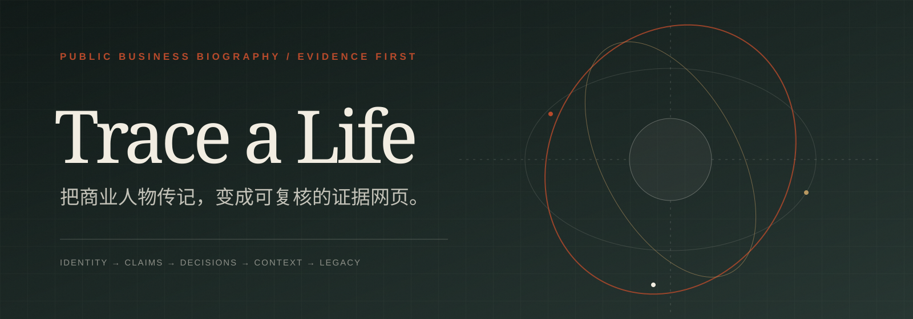
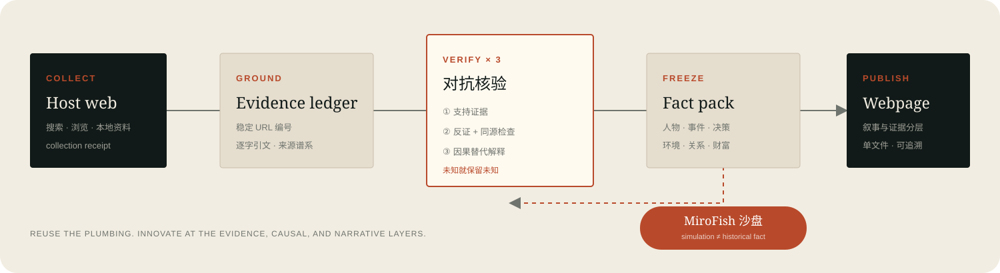

<p align="center"></p>

<p align="center"><strong>不是再写一篇“他如何成功”的故事。</strong><br><sub>先查清谁做了什么，再解释当时为什么会这样，最后才允许讲故事。</sub></p>

---

一本商业传记常把几十年的历史压成一条漂亮直线：

```text
出身普通 → 抓住机会 → 白手起家 → 登上巅峰 → 遭遇危机 → 传给下一代
```

现实往往更像：

```text
个人判断 × 合伙人 × 融资条件 × 政策窗口 × 行业周期 × 组织能力
                         ↓
                 后来被写成一个人的传奇
```

`Trace a Life` 是一个面向公开商业人物的调查 Skill。它重建起家、扩张、关键决策、危机、退出和代际传承，并把每个关键判断连接回来源。最终交付是一张可阅读、可筛选、可展开证据的单文件网页。

## 不造轮子的架构

这个项目不实现新的搜索引擎、爬虫、向量库或通用多 Agent 平台。它是一个编排与分析层：

<p align="center"></p>

| 层 | 直接复用 | 本项目只增加什么 |
|---|---|---|
| 采集与知识库 | **宿主网页检索 / 本地材料** | 人物案件的查询矩阵、来源缓存与采集回执 |
| 引用与逐字证据 | **Hermes Grounded Citations** | 将账本编号绑定到案件主张与网页证据抽屉 |
| 人物/企业消歧 | **UseOSINT Skills** | 限定为公开商业史，并把身份锚点写入案件契约 |
| 对抗尽调 | **benchmark-due-diligence** | 去掉“我如何复制”，改为起家—转折—传承的历史核验 |
| 情景推演 | **MiroFish** | 只把冻结事实导出为 seed，并禁止模拟反向污染史实 |
| 网页表达 | **skill-to-webpage 的可追溯理念** | 为人物商业史设计四幕、时间线、决策、关系、财富和证据页面 |

真正新增的部分只有三项：

1. **商业生平案件模型**：统一人物、实体、原子主张、事件、决策、社会环境、关系和财富传承。
2. **三轮反复核查**：支持证据 → 反证与来源谱系 → 因果替代解释；三轮后仍缺证据就保留未知。
3. **事实与模拟隔离**：只有冻结事实包能进入 MiroFish；模拟结果永远标为 `simulation`。

## 模块与 Agent 团队

项目已经从单体脚本拆成六个可独立维护的运行时模块，并由 Leader 编排：

| 模块 | 目录 | 交付物 |
|---|---|---|
| 公共契约 | `xray_person/contracts/` | stage、handoff、gate、artifact SHA-256 |
| 案件与研究 | `domain/`、`research/` | 引用索引、21 条查询、verification report |
| 外部集成 | `integrations/` | 可选工具回执、MiroFish seed/plan |
| 页面投影 | `presentation/` | view model、case/view-model HTML attestation |
| 发布验收 | `delivery/` | manifest、静态 QA、漂移和模拟泄漏检查 |
| Leader 编排 | `orchestration/` | `run.json`、逐阶段 handoff 和门禁状态 |

精确到文件的职责、依赖方向和案件制品目录见 [模块架构](docs/ARCHITECTURE.md)；Agent 的独占目录、开工/完工模板和交叉审查规则见 [组队与交付手册](docs/AGENT-OPERATIONS.md)；本轮七个子 Agent 的接口对齐、审查关闭状态和保留边界见 [多 Agent 最终交付](docs/TEAM-DELIVERY.md)。

## 页面长什么样

仓库带有一个完全虚构的演示案件，所有人物、公司、文件和引文均为造数，只展示结构与交互：

- [打开虚构示例网页](examples/fictional-founder/index.html)
- [查看示例案件数据](examples/fictional-founder/case.json)
- [查看导出的 MiroFish seed](examples/fictional-founder/simulation/mirofish-seed.md)

网页包含：

- 起家 / 登顶 / 转折 / 退出或传承四幕；
- 可筛选的事实、自述、推断与争议时间线；
- “当时已知什么、有哪些选项、什么会推翻当前解释”的决策剖面；
- 人物—公司—资本—制度关系网络；
- 收入、所有权、控制权与传承路径；
- 六级主张核验和独立来源簇；
- 逐条来源与原文证据抽屉；
- 与史实分离的 MiroFish 反事实沙盘。

页面为单文件 HTML，不依赖 CDN 或远程字体；移动端会把关系图降级成可读列表。

## 安装 Skill

在本仓库根目录执行：

```bash
npx skills add . --skill trace-a-life
```

也可以把 `skills/trace-a-life/` 复制到你的 Skill 目录。

宿主网页检索和浏览能力是默认采集路径；用户提供的本地材料也可以进入案件证据池。本项目不会把计划中的工具调用伪装成已执行，也不会临时造一个 crawler。

## 公开研究页与 GitHub Pages

仓库把研究原始材料与公开结果分开保存。`website/` 只包含经过字段白名单投影的结论、来源链接、研究状态和可阅读网页；不会复制 `cases/` 下的音频、逐字稿、RSS 或研究日志。

本地有最新案件时，先同步公开结论，再构建站点：

```bash
python3 scripts/build_pages.py --sync-cases
python3 scripts/build_pages.py --check
```

只构建已同步的公开快照时，第二条命令足够。GitHub Pages 工作流发布 `website/` 目录；它不需要访问本地原始案件，也不会把原始研究材料放进 Pages。站点模板位于 `publishing/index.template.html`；直接打开它会跳转到生成后的 `website/index.html`。

## 腾讯云 ASR 配置

人物长访谈默认采用腾讯云录音文件识别做第一路多人转写。所有密钥和可变配置集中在根目录 [`.env.example`](.env.example)，真实值只写入被 `.gitignore` 排除的 `.env`：

```bash
cp .env.example .env
```

账户侧需要：

1. 开通腾讯云语音识别，并在“资源包管理”确认“录音文件识别”免费资源包已经发放且仍有余量；不要为了连通测试自动开启后付费；
2. 创建最小权限的 CAM 子账号/API 密钥，不使用主账号永久密钥；先为该身份关联腾讯云预设策略 `QcloudASRFullAccess` 验证链路，稳定后可改为只允许 `asr:CreateRecTask` 与 `asr:DescribeTaskStatus` 的自定义策略；
3. 长访谈的 WAV 通常超过本地数据 5 MB 限制，因此创建私有 COS Bucket，并把 Bucket 名和区域填入 `.env`；
4. 只给该子账号 ASR 提交/查询以及指定 COS Bucket 前缀所需权限；不把 Secret 写入案件 JSON、日志或聊天。

免费默认配置使用通用 `16k_zh`、单声道、匿名说话人自动分离和带词级时间戳的标点分段。`16k_zh_en_2.0` 属于单独计费且没有每月免费额度的大模型 2.0 产品；只有用户明确接受费用时才切换。`ResTextFormat=4/5`、情绪识别和声纹实名也属于额外收费能力，免费路径保持关闭。超过 5 MB 的音频通过短时 COS 预签名 URL 提交；对象保持私有，只在 ASR 任务成功或失败进入终态后按配置删除，不能提交后立即删除。

项目依赖隔离安装在根目录 `.venv`：

```bash
python3 -m venv .venv
.venv/bin/pip install -r skills/trace-a-life/requirements-asr.txt
.venv/bin/python skills/trace-a-life/scripts/transcribe_tencent_asr.py --check-config
```

真实请求若返回 `FailedOperation.UserHasNoAmount` 或 `FailedOperation.UserHasNoFreeAmount`，表示 CAM 已经通过，但请求没有可用的匹配额度。先核对引擎是否误用了不受免费包覆盖的 `16k_zh_en_2.0`，再确认服务已开通及每月免费资源包已生效；除非用户明确接受计费，否则不要开启后付费。

## 直接使用

给一个人物和至少一个身份锚点：

```text
调查刘益谦的商业生平。以“法人股交易与艺术品收藏”为身份和叙事锚点，
重点核查他如何起家、财富来源怎样变化、哪些关键决策与政策/市场周期有关、
他与公司和资本方的关系、争议以及财富传承。最后生成可追溯网页。
```

如果来自一本书，最好同时给出页码和原文：

```text
书中第 X 页称……
请把这段话拆成原子主张，逐条核验，不要把书本身当事实来源。
```

如果想做反事实分析，再单独提出：

```text
在事实包冻结后，导出 MiroFish seed，推演“如果当年没有做这笔收购，
公司、合伙人、债权人与下一代的路径可能如何变化”。
```

## 手动流程

### 1. 初始化案件

```bash
python3 skills/trace-a-life/scripts/init_case.py \
  --name "人物名" \
  --anchor "公司 / 职位 / 城市 / 年份" \
  --output cases/person-slug
```

### 2. 登记来源和逐字证据

本地已有合法取得的视频时，先复用 FFmpeg 提取 ASR 音频：

```bash
python3 skills/trace-a-life/scripts/extract_audio.py \
  cases/person-slug/raw/interviews/video/interview.mp4 \
  --output cases/person-slug/raw/interviews/audio/interview.asr.wav \
  --manifest cases/person-slug/raw/interviews/audio/interview.audio.json
```

默认输出 `16 kHz / 单声道 / PCM WAV`。脚本不下载视频、不绕过平台访问控制，也不内置音视频解码器；需要系统已安装 FFmpeg。多人识别 API 的能力矩阵与选择规则见 [`audio-transcription-apis.md`](skills/trace-a-life/references/audio-transcription-apis.md)。

提交腾讯云录音文件识别并轮询结果：

```bash
.venv/bin/python skills/trace-a-life/scripts/transcribe_tencent_asr.py \
  cases/person-slug/raw/interviews/audio/interview.asr.wav \
  --output cases/person-slug/raw/interviews/audio/interview.tencent-asr.json
```

不超过 5 MiB 的音频直接以内联数据提交；更大的文件必须先配置私有 COS Bucket。输出 JSON 保留匿名 `speaker_id`、句段和词级时间戳、原始响应与来源 SHA-256，但不会保存 Secret 或预签名 URL 查询参数。

完整转写不能直接进入事实层。必须运行五道访谈门禁：既有事件/主张对齐、带证据的说话人身份假设、严格绑定 ASR segment 的连续章节、秘辛候选提取、第三轮外部独立核验。首次运行会先生成候选和 `blocked` manifest：

```bash
python3 skills/trace-a-life/scripts/analyze_interview_transcripts.py \
  cases/person-slug/case.json
```

执行支持证据与反证搜索后，把每条候选的查询、来源谱系和结论写入 `research/interviews/external-verification-evidence.json`，再完成门禁并更新案件引用：

```bash
python3 skills/trace-a-life/scripts/analyze_interview_transcripts.py \
  cases/person-slug/case.json \
  --external-evidence cases/person-slug/research/interviews/external-verification-evidence.json \
  --update-case

python3 skills/trace-a-life/scripts/validate_interview_analysis.py \
  cases/person-slug/case.json
```

多个节目中的同一人复述只算一个自述来源。没有独立旁证不是失败，但最终状态必须停在 `self_reported`、`unverified` 或 `dispute`；缺少实际第三轮搜索才是门禁失败。完整协议见 [`interview-analysis-protocol.md`](skills/trace-a-life/references/interview-analysis-protocol.md)。

然后登记来源和逐字证据：

```bash
python3 skills/trace-a-life/scripts/vendor/grounded_citations/sources.py \
  --ledger cases/person-slug/evidence/ledger.json \
  add "https://example.com/source" --title "来源标题"
```

### 3. 校验案件

```bash
python3 skills/trace-a-life/scripts/validate_case.py \
  cases/person-slug/case.json --strict
```

### 4. 可选导出 MiroFish seed

```bash
python3 skills/trace-a-life/scripts/export_mirofish_seed.py \
  cases/person-slug/case.json \
  --question "如果关键决策 X 没有发生，会怎样？" \
  --output cases/person-slug/simulation
```

### 5. 渲染网页

```bash
python3 skills/trace-a-life/scripts/render_case.py \
  cases/person-slug/case.json \
  --output cases/person-slug/site/index.html
```

不要手改生成的 HTML；改 `case.json` 后重新渲染。

### 6. 由 Leader 重放整个流程

当案件已有来源、结构化三轮核验记录并已冻结时，可一次生成所有可再生制品：

```bash
python3 skills/trace-a-life/scripts/run_pipeline.py cases/person-slug
```

Leader 会生成 `query-plan.json`、宿主网页采集计划、`verification-report.json`、view model、带输入哈希的 HTML、delivery manifest、QA report、`run.json` 和逐阶段 handoff。命令不会自行联网，也不会假装执行网页工具或 MiroFish；证据尚未采集时返回退出码 `2` 并停在 `blocked`。离线重放中的 MiroFish 阶段固定为 `skipped/reported-only`，只有宿主提供真实执行回执时，Integration API 才允许推进外部执行状态。

## 案件结构

```text
cases/person-slug/
├── case.json
├── source-narrative.md
├── research-log.md
├── evidence/ledger.json
├── raw/
├── research/
│   ├── query-plan.json
│   ├── collection-plan.json
│   └── verification-report.json
├── analysis/view.json
├── simulation/
├── site/
│   ├── view-model.json
│   └── index.html
├── delivery/
│   ├── manifest.json
│   └── qa-report.json
└── pipeline/
    ├── run.json
    └── handoffs/<run-id>/
```

完整字段见 [`case-schema.md`](skills/trace-a-life/references/case-schema.md)。

## 证据纪律

主张使用六级结论：

| 结论 | 含义 |
|---|---|
| 坐实 | 一手文件或同期直接记录支持 |
| 基本可信 | 多个独立可靠来源一致 |
| 部分真实 | 事件存在，但时间、金额、角色或因果被简化 |
| 当事人自述 | 只能追溯到本人、家族或公司 |
| 未证实 | 有具体说法但公开证据不足 |
| 证据冲突 | 时间线或文件不支持该说法 |

“十篇文章都这么说”可能仍然只有一个源头。每个来源都有 `origin_cluster`；独立来源数按源头簇计算，而不是按 URL 计算。

## 上游参考

所有上游项目都固定在 [`references/upstream/`](references/upstream/)，并保留原许可证。版本、用途和是否进入运行时见 [`references/UPSTREAMS.md`](references/UPSTREAMS.md)。这些快照是参考材料，不会自动作为 Skill 执行。

其中 MiroFish 为 AGPL-3.0，本项目只保存独立的参考快照与数据导出边界，不复制或链接其运行时代码。内置的 Grounded Citations 账本脚本按上游 MIT 许可证原样附带。

## 验证

```bash
python3 -m unittest discover -s tests -v
python3 -m unittest discover -s skills/trace-a-life/tests -v
python3 /Users/yuwanz/.codex/skills/.system/skill-creator/scripts/quick_validate.py \
  skills/trace-a-life
```

## 许可

本项目原创部分采用 MIT License。`references/upstream/` 与 `scripts/vendor/` 中的第三方内容分别适用各自目录内的许可证。
